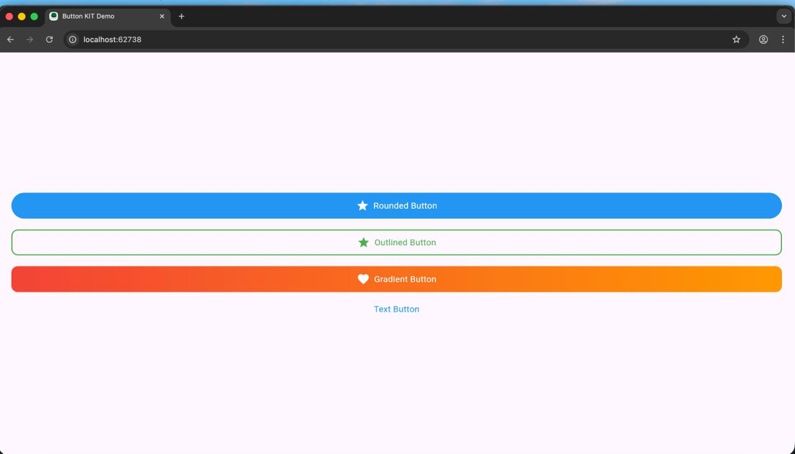
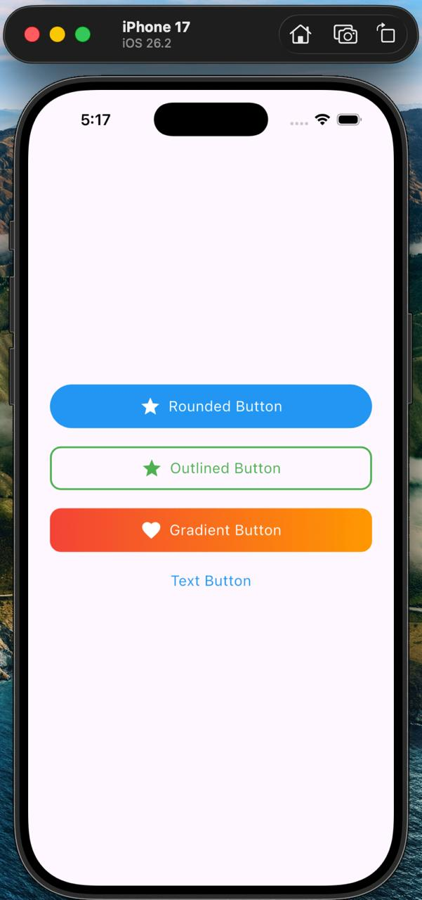
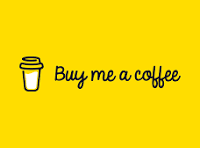

# ButtonKit

A simple, beautiful, customizable button library for Flutter.
ButtonKit provides modern Flutter buttons with:

      - Rounded Button
      - Outlined Button
      - Gradient Button
      - Text Button
      - ButtonKit Button (single widget for all types)
      - Prefix Icons
      - Tap/Press animation (scale effect)
      - Long text handling with ellipsis
      - Custom colors, gradients, radius & sizes

[//]: # (![buttonKitMobile.jpeg]&#40;assets/buttonKitMobile.jpeg&#41;)

## ✨ Features

🟦 4 Ready-made buttons

      - RoundedButton
      - OutlinedBtn
      - GradientButton
      - SimpleTextButton
### 🎛 ButtonKit Widget

One entry point → choose type using ButtonType

Clean & simple API

🎨 Highly customizable

      ->Colors
      ->Text styles
      ->Gradient colors
      ->Border colors
      ->Radius, height, padding
      ->🖼 Prefix icon supported
      ->Asset image
      ->Icon widget

##   🔥 Built-in press animation

   - Smooth scale effect on tap

##   📱 Auto text handling

   - Supports long text

   - Truncates with ellipsis

   - Icon + text stays centered

## 📥 Installation

Add this to your pubspec.yaml:

      dependencies:
      button_kit: ^1.0.0

Import in your file:

      import 'package:button_kit/button_kit.dart';

## 🚀 Usage
🔥 Universal Button (Recommended)

Use one single widget for all button types:

      ButtonKit(
      type: ButtonType.rounded,
      title: "Click Me",
      prefixIcon: Icon(Icons.touch_app, color: Colors.white),
      onTap: () {},
      );

## Supported types:

      enum ButtonType {
            rounded,
            outlined,
            gradient,
            text,
      }

## 💡 Example UI Page

      class ButtonDemo extends StatelessWidget {
      const ButtonDemo({super.key});
      @override
      Widget build(BuildContext context) {
      return Scaffold(
      body: Center(
      child: Column(
      mainAxisAlignment: MainAxisAlignment.center,
      children: [

            ButtonKit(
              type: ButtonType.rounded,
              title: "Rounded Button",
              onTap: () {},
            ),

            const SizedBox(height: 20),

            ButtonKit(
              type: ButtonType.outlined,
              title: "Outlined Button",
              prefixIcon: Icon(Icons.star, color: Colors.blue),
              onTap: () {},
            ),

            const SizedBox(height: 20),

            ButtonKit(
              type: ButtonType.gradient,
              title: "Gradient Button",
              gradientColors: [Colors.purple, Colors.blue],
              prefixIcon: Icon(Icons.favorite, color: Colors.white),
              onTap: () {},
            ),

            const SizedBox(height: 20),

            ButtonKit(
              type: ButtonType.text,
              title: "Text Button",
              onTap: () {},
            ),
          ],
        ),
      ),
    );
}
}

## ⚙️ Customization Options
         Property	    |    (Description)
         ===============================
         title:	           (Button text)
         prefixIcon:       (Widget)
         onTap:	           (Tap callback)
         color:	           (Solid color button)
         textColor:	       (Text color)
         borderColor:      (Border color)
         gradientColors:   (For gradient button)
         radius:           (Button corner radius)
         height:           (Button height)

## 🧩 Tap Animation

All buttons use a PressEffect widget:

- Press down → scales to 0.95

- Release → scales back to 1.0

- Smooth 120ms animation

## 📄 License

MIT License
Feel free to use in personal and commercial projects.

# ❤️ Support
      
      If you like this package, please ⭐ star it on pub.dev and GitHub!  
      Your encouragement helps this project grow and reach more developers.

# ☕ Buy Me a Coffee
      
If this package has helped you or saved you development time, please consider supporting my open-source work.  
Your support motivates me to continue improving this package and building more useful Flutter tools.

